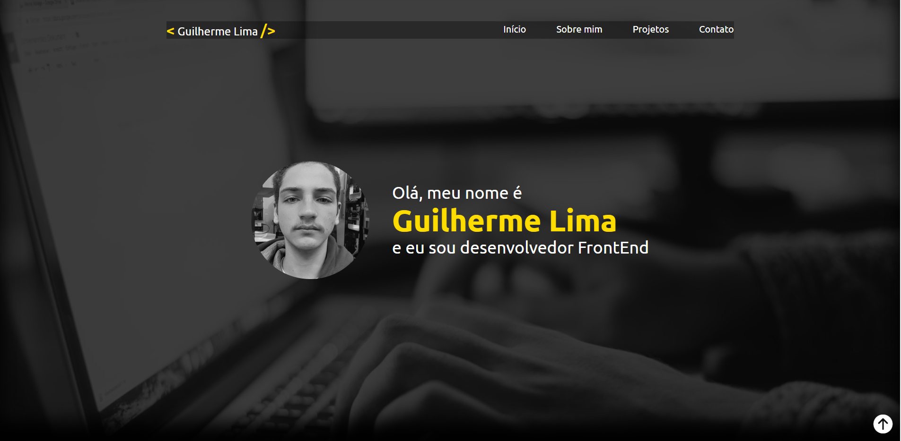

# Portfolio

[Clique aqui](https://guilima005.github.io/portfolio/) para acessar o site.
---
## Sobre
Site do tipo landing page para divulgar o meu portfolio.
O objetivo deste projeto é colocar em pratica os conhecimentos adquiridos no curso do [Senai Jandira](https://jandira.sp.senai.br/) na criação de web sites.

---
## Tecnologias utilizadas
- HTML
- CSS
- Responsividade
- Markdown

---
## Autor
- [Guilherme Lima](https://github.com/GuiLima005)